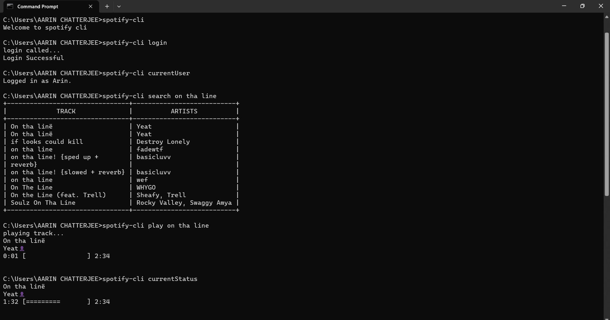

# spotify-cli
A cli application for spotify built using Golang

## Tools & Technologies used
*Language:* Golang  

*Frameworks/Packages:*
* Cobra-cli
* Spotify
* Viper
* Browser

# Screenshot

## Commands
<table>
  <tr>
    <td><code>login</code></td>
    <td><code>login to your account</code></td>
  </tr>
   <tr>
    <td><code>currentUser</code></td>
    <td><code>returns name of current user</code></td>
  </tr>
  <tr>
    <td><code>play [name]</code></td>
    <td><code>plays a track</code></td>
  </tr>
  <tr>
    <td><code>play --album=[album]</code></td>
    <td><code>plays the albums</code></td>
  </tr>
  <tr>
    <td><code>toggle</code></td>
    <td><code>toggles between play and pause</code></td>
  </tr>
  <tr>
    <td><code>queue [track]</code></td>
    <td><code>add song to queue</code></td>
  </tr>
  <tr>
    <td><code>currentStatus</code></td>
    <td><code>returns current playback status</code></td>
  </tr>
  <tr>
    <td><code>save</code></td>
    <td><code>toggles between save and unsave current track</code></td>
  </tr>
  <tr>
    <td><code>next</code></td>
    <td><code>skips to next track in the queue</code></td>
  </tr>
  <tr>
    <td><code>search [keyword]</code></td>
    <td><code>return list of tracks matching the keyword</code></td>
  </tr>
</table>

PS: Spotify Premium is required for playback
